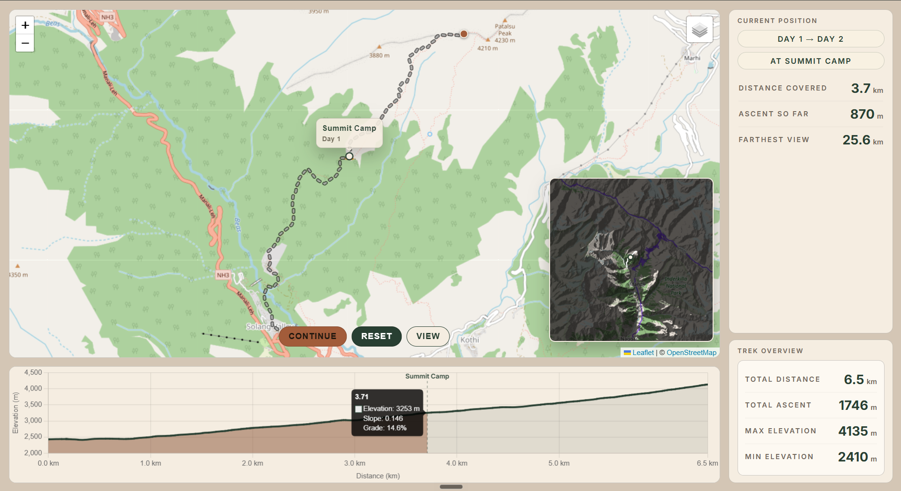

# mapping-demo — viewshed edition

An interactive trek route viewer — the kind of thing a trek page would embed
instead of a static image and a paragraph of text. Built as a commercial demo.

This repo is the second pass on the original mapping-demo: the foundation got
fixed, and the viewer now shows **what you can actually see from the trail** as
the marker moves.

**Original version:** https://www.trekmaps.in/
**Build writeup (original):** [Raw write-up of a demo I built while extending RidgeView](https://medium.com/@akshmittal/raw-write-up-of-a-demo-i-built-while-extending-ridgeview-6d7679a2cbfe)

An extension of [RidgeView](https://github.com/AkshMittal/RidgeView). I pulled
out only what I needed — the map, the chart, some sync logic — and left the
rest, so I could stop fighting UI and work on the actual problem.

**demo image:** 

---

## The problem it actually solves

RidgeView visualized a raw GPX file. That was never the truth. GPX files are
noisy, and zoomed in they straight up lie — and computing distance, elevation
gain and slope off raw points distorts all three.

So the first real work was cleaning the data.

I smooth with a moving average. It's probably not standard GIS practice, but it
lies less than raw GPX does. The goal was never scientifically correct
coordinates — it was **data that is true at a distance**. Different recorders log
at different intervals, distances and accuracies, so the smoothing window is
chosen from the point count of the file, which balances performance against
visual honesty.

---

## What changed in this version

### Fixed

- **One index again.** The original split into a main index, a separate
  `playbackIndex` and fractional indexing (story below). Once the real cause —
  a full `chart.update()` every frame — was out of the loop, all of that came
  out. Now a single `index` plus a `playing` flag drive the marker, chart,
  panels, day highlight, camp stops and button states. Button state is derived
  from the index, never stored.
- **Camp stops without snapping windows.** Playback turns elapsed time into an
  integer index; if a camp lies between the current and next index, it lands
  exactly on it and stops. No proximity guesses, no "last paused camp" state.
- **Camp snapping is one implementation.** Hover snapping is a single check in
  `setIndex`, measured in screen pixels of whatever is hovered (map or chart),
  so it scales with zoom by itself — the old fixed threshold is gone.
- **Elevations come from a DEM.** Every GPX point's elevation is replaced with
  the Copernicus GLO-30 value at that point. Recorded elevations were offset by
  tens of metres and noisy, which is what made ascent and grade jumpy.
- **Sparse tracks are densified.** Points are filled in every 10 m before the
  DEM step, so a 50 m-spaced recording still gives a smooth line, hover and
  playback.
- **GPX loads with a plain `fetch`.** The leaflet-gpx plugin was only there to
  trigger a second fetch; it's gone, along with its console warning.

### Removed

- Dual-index system, fractional indexing, both camp-snap windows
- Vite — the page is plain static files (native ES modules, Leaflet and
  Chart.js from CDNs)
- Kedarkantha route (had no camp data), unused `camps.js`, the old plan and
  scoping notes

### Added

- **Viewshed.** A dim mask over the map with the ground visible from the
  current position cut out. It follows the same single index as everything
  else — no new sync system.
  - Precomputed per route (`tools/viewshed/`): `gdal_viewshed` every 150 m along
    the route, observer at 1.7 m.
  - Each shown mask is the **union of the viewsheds ±3 samples (~±450 m)**
    around the point. A single point is prone to one-off obstructions; the
    union shows the view around that stretch.
  - Feathered edges, 250 ms crossfade between masks, masks shipped as small
    alpha PNGs on a shared grid. The dim level is CSS, per map/layer.
  - Commercial styling on purpose: one soft highlight, no colormap, no legend.
- **Inset map.** A fixed, non-interactive overview in the corner showing the
  full viewshed extent with the mask always on. The main map stays free to pan
  and zoom, frames the route, and has the viewshed as an optional VIEW toggle.
- **Patalsu route.** Viewsheds work best on a climb, not a valley, so the demo
  now shows Patalsu (Solang Valley → Summit Camp → summit, ascent only). Camps
  can be placed by coordinates; the last day runs to the route end. Hampta Pass
  is still available.
- **Live figures.** Distance covered, ascent so far and farthest visible
  distance update with the position; whole-trek figures sit in their own card.
- **Chart.** Progress fill up to the current position and a labelled line at
  each camp.
- **Mobile layout.** Single scrolling column, compact metric grids, tap on the
  route to move, horizontal drag on the chart to scrub.
- **Style.** Start/end markers in the page palette, outlined VIEW toggle, Inter
  actually loaded, tile-gap and focus-ring fixes, no iframe-style rounded page.
- **Netlify deploy** (`netlify.toml`) that publishes only the page's files.

### Decisions worth recording

- **DEM buffer:** 20 km around the route for Patalsu (reaches Deo Tibba). For
  Hampta, a +5 km test added ~7.6% visible area on average — not worth it.
- **Union over gradients:** plain OR of neighbouring viewsheds. No weighting;
  it was the simplest thing that looked clearly better than a single point.
- **Delta-encoding masks** against a reference was considered and dropped:
  payload is ~3 MB, swaps are one `setUrl`, nothing measurably needed it.
- **Precompute, then hardcode.** Fit extents, farthest distances and hole
  bounds are computed once and stored in the manifest.

---

## The dual-index system, and why it existed

The history behind the "Fixed" section above.

I committed early to a single source of truth: one index driving the chart, the
map, the info panels and playback. Correct model. But playback was ugly — the
marker skipped frames and hopped across the route.

I learned about frame limiting and aligned playback to `requestAnimationFrame`.
Better, still bad. I concluded that one index serving every dynamic element was
too heavy for the playback loop, and split it: a main index for chart and map, a
separate `playbackIndex` for timeplay, plus **fractional indexing** so the marker
moves smoothly across skipped frames. That bought smoothness and cost a pile of
sync rules — when the two indices agree, when they don't, and how hover,
playback and chart interaction each touch both.

Then I got a syntax error in the chart module. The chart didn't load. Playback
was suddenly butter smooth.

The chart was the performance killer. I had been calling `chart.update()` on
every iteration of the playback loop, rebuilding the entire chart every frame,
when `chart.draw()` or `chart.update('none')` was what I wanted. **The whole
dual-index system existed because of that one mistake.**

In the original I kept it, because too much had been built on top. This version
is where it finally came out — before the viewshed went in, so the new layer
could read one index like everything else instead of inheriting the tangle.

---

## Other things worth knowing

**Precompute anything that can be precomputed.** RidgeView computed slope
dynamically for hover tooltips, which tanked on fast hovers. Slope and related
metrics go into arrays at load time and the chart reads static data. The
viewshed follows the same rule, taken further: everything is computed offline.

**CSS beat async wiring.** Panning the map could trigger chart hovers and route
snapping. A class toggled during panning kills pointer events on the chart.
Crude, effective, much cleaner than the alternative.

**Recentering by visibility, not bounds.** It tracks whether the marker is
actually in view and only recenters when it isn't — so a small pan doesn't yank
the map back.

**Bi-directional sync got deleted.** Once timeplay and the camp/day panels
existed, a single source of truth with unidirectional flow was clearly right.

---

## Structure

```
src/js/
├── main.js               entry
├── route-config.js       which route the page shows
├── controller-module.js  the single index + everything derived from it
├── gpx-engine.js         loading, smoothing, playback, camps, route drawing
├── map-module.js         Leaflet setup
├── chart-module.js       elevation chart, progress fill, camp lines
├── itinerary-module.js   camps and day logic
├── viewshed-module.js    mask layer (attachable to any map)
└── inset-module.js       fixed viewshed overview map
public/routes/<route>/    prepared GPX, source GPX, camps.json
public/viewshed/<route>/  mask PNGs + manifest (Patalsu committed)
tools/viewshed/           precompute pipeline (Python, GDAL)
```

**Tech:** vanilla JavaScript (ES modules), Leaflet, Chart.js. No framework, no
build step. Precompute: Python, GDAL, rasterio, Planetary Computer.

### Regenerating a route

```
conda env create -f tools/viewshed/environment.yml
# VIEWSHED_ROUTE=patalsu (default) or hampta-pass
conda run -n viewshed python tools/viewshed/fetch_dem.py          # DEM, route bbox + buffer
conda run -n viewshed python tools/viewshed/prepare_route.py      # densify + DEM elevations
conda run -n viewshed python tools/viewshed/compute_viewsheds.py  # slow, once
conda run -n viewshed python tools/viewshed/render_masks.py       # fast, tune here
```

Switch the page with `ROUTE` in `src/js/route-config.js`.

---

## Status and known limits

A demo, and now on a foundation that holds.

- Smoothing is still a moving average. The fuller sequence is **outlier removal
  → smoothing → downsampling**; the DEM elevations and densifying cover the
  worst of it for these routes.
- Routes are configured by hand (config + `camps.json`). Fine for a demo; each
  new route gets its own config.
- Timeplay is animation over point index, not elapsed time — deliberately; the
  day/camp structure already carries the time dimension.
- Farthest view is limited to the DEM extent used for that route.
- Route tracks are Wikiloc recordings; map tiles are OSM / CyclOSM / Esri. Both
  need licensing checked before any commercial use.
